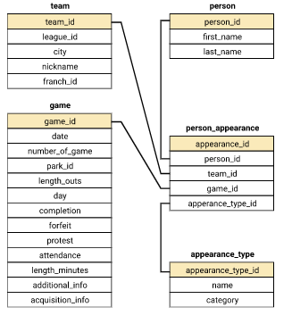

### Creating an MLB Database

This project aims to create a Major League Baseball Games database based on the gathered statistics from the year 1800 until today. The goal of this lesson is to convert and normalize this data into several separate tables using SQL and create a robust database of game-level statistics.

In addition to the objectives above, we'll be applying the following concepts in this project:
- SQL Fundamentals
- SQL Joining
- Querying from SQLite

To understand how the database was created, here are the steps of the process outlined below:

### Loading the Packages

We'll first be loading the packages that will be used in creating this project. The details of the packages are outlined below:

- tidyverse: for loading all data-science related libraries (cleaning the data, data viz, etc.)
- RSQLite: helps create SQL queries in R
- DBI: connects R to the DMS (Database Management Systems)

```{r load_packages, echo=TRUE, warning=FALSE}

#Loads packages without startup messages
suppressPackageStartupMessages(library(tidyverse))
suppressPackageStartupMessages(library(RSQLite))
suppressPackageStartupMessages(library(DBI))

```

### Loading the Data

The following datasets are obtained in the links below:

- game_log.csv - <https://dsserver-prod-resources-1.s3.amazonaws.com/376/game_log.csv>
- park_codes.csv - <https://dsserver-prod-resources-1.s3.amazonaws.com/376/park_codes.csv>
- person_codes.csv - <https://dsserver-prod-resources-1.s3.amazonaws.com/376/person_codes.csv>
- team_codes.csv - <https://dsserver-prod-resources-1.s3.amazonaws.com/376/team_codes.csv>


```{r load_datasets, echo=TRUE, warning=FALSE}

# loads all the datasets without any column messages
game_log <-  read_csv("game_log.csv", 
                            col_types = cols(.default = "c",
                                             v_league = "c", 
                                             h_league = "c",
                                             `3b_umpire_id` = "c", 
                                             `3b_umpire_name` = "c",
                                             `2b_umpire_id` = "c", 
                                             `2b_umpire_name` = "c",
                                             `lf_umpire_id` = "c", 
                                             `lf_umpire_name` = "c",
                                             `rf_umpire_id` = "c", 
                                             `rf_umpire_name` = "c",
                                             completion = "c", 
                                             winning_rbi_batter_id = "c",
                                             winning_rbi_batter_id_name = "c", 
                                             protest = "c",
                                             v_first_catcher_interference = "c", 
                                             h_first_catcher_interference = "c"),
                      show_col_type = FALSE) # corrects the labels of the remaining statistics
park_codes <- read_csv("park_codes.csv", show_col_type = FALSE)
person_codes <- read_csv("person_codes.csv", show_col_type = FALSE)
team_codes <- read_csv("team_codes.csv", show_col_type = FALSE)
appearance_type <- read_csv("appearance_type.csv", show_col_type = FALSE)

```

The first dataset (game_log) represents our main dataset of this project. This dataset contains a total of 171,907 rows with 161 variables. It contains all of the details of a game bet. two teams (who are the team players), what are the relevant statistics of the game, where it had occurred, when it had occurred, and how the game ended.

```{r game_log, echo=TRUE, warning=FALSE}

glimpse(game_log) # prints the dimensions and columns of game log
head(game_log) # gets the first five rows of game log

```

Here are some additional definitions on the variables/columns found in the game log which will be used in the database:

Defensive numbers

- Putout - A fielder is credited with a putout when he is the fielder who physically records the act of completing an out -- whether it be by stepping on the base for a forceout, tagging a runner, catching a batted ball, or catching a third strike.

- Innings played - Innings played is a defensive statistic determined by counting the number of outs during which a player is in the field and dividing by three.

- Assist - An assist is awarded to a fielder who touches the ball before a putout is recorded by another fielder. Typically, assists are awarded to fielders when they throw the ball to another player -- but a fielder receives an assist as long as he touches the ball, even if the contact was unintentional.

- Error - A fielder is given an error if, in the judgment of the official scorer, he fails to convert an out on a play that an average fielder should have made.

- Passed ball - A catcher is given a passed ball if he cannot hold onto a pitch that -- in the official scorer's judgment -- he should have, and as a result at least one runner moves up on the bases.

- Double Play - A double play occurs when two offensive players are ruled out within the same play. It's often referred to as "a pitcher's best friend" because it's twice as helpful toward his cause as any given out.

- Triple Play - A triple play occurs when the defending team records three outs on a single defensive play.


```{r game_log_columns, echo=TRUE, warning=FALSE}

colnames(game_log) # prints the columns of game log

```

The second dataset (park_codes) represents our first subset data for this project. This dataset contains a total of 252 rows with 9 variables. It contains details of where precisely a game has occurred, how long did the game ended, and which league played the game. Common column with game log is park_id.

```{r park_codes, echo=TRUE, warning=FALSE}

glimpse(park_codes) # prints the dimensions and columns of park codes
head(park_codes) # gets the first five rows of park codes

```

The third dataset (person_codes) represents our second subset data for this project. This dataset contains a total of 20,494 rows with 7 variables. It contains the details of each player (when they started playing, coaching, or managing). Common column with game log is id.

```{r person_codes, echo=TRUE, warning=FALSE}

glimpse(person_codes) # prints the dimensions and columns of person codes
head(person_codes) # gets the first five rows of person codes

```

The fourth (and last) dataset (team_codes) represents our last subset data for this project. This dataset contains a total of 150 rows with 8 variables. It contains the details of the team participating in the game (what the team is, how long they have been playing). Common id with game log file is team_id and or franch_id.

```{r team_codes, echo=TRUE, warning=FALSE}

glimpse(team_codes) # prints the dimensions and columns of team codes
head(team_codes) # gets the first five rows of team codes

```

### Creating the SQL Tables for the Database

After loading and defining all of the datasets, we'll be proceeding with creating a new database to load and convert all of our datasets into SQL tables. To ensure that we have loaded all datasets, we'll be listing all of the tables created using an additional function.

```{r connect_db, echo=TRUE, warning=FALSE}

conn <- dbConnect(SQLite(), "mlb.db") # Creates a database file for combining all datasets

# Connects with the new database file and creates new tables for each dataset with their corresponding names

dbWriteTable(conn = conn, 
             name = "game_log",
             value = game_log, 
             row.names = FALSE,
             header = TRUE,
             overwrite=TRUE)

dbWriteTable(conn = conn, 
             name = "park_codes", 
             value = park_codes, 
             row.names = FALSE, 
             header = TRUE, 
             overwrite=TRUE)

dbWriteTable(conn = conn,
             name = "person_codes", 
             value = person_codes, 
             row.names = FALSE, 
             header = TRUE, 
             overwrite=TRUE)

dbWriteTable(conn = conn, 
             name = "team_codes", 
             value = team_codes, 
             row.names = FALSE, 
             header = TRUE, 
             overwrite=TRUE)

dbWriteTable(conn = conn, 
             name = "appearance_type_raw", 
             value = appearance_type, 
             row.names = FALSE, 
             header = TRUE, 
             overwrite=TRUE)

# Lists all tables in the created database

dbListTables(conn)

```

Since our aim is to link each of the tables altogether, we'll be working on creating primary and secondary keys for each of our tables based on their relationships. We'll start off by creating a master key / primary key in the main table (game_log) using three columns: the date in which the game was played, the name of the home team for that game, and the number of games played. This will also serve as our unique identifier for row in the master dataset that we'll be linking to the other tables.

```{r create_master_key, echo=TRUE, warning=FALSE}

create_game_id <- '
ALTER TABLE game_log
ADD COLUMN game_id TEXT 
' # add a blank column for the master key
dbExecute(conn, create_game_id)

update_rows <- '
UPDATE game_log
  SET game_id = date || h_name || number_of_game
WHERE game_id IS NULL;
' # creates a unique master key based on the date, current home team, and number of games played
dbExecute(conn, update_rows)

view_rows <- '
SELECT * FROM game_log LIMIT 5
' # views the changes made

dbGetQuery(conn,view_rows)[,c(1:7)]
# displays the first 7 columns

```

Using the schema below, we'll start normalizing the data by creating primary keys for each table and linking them to the corresponding tables. We'll also include only the unique columns for each of the table to be used. Here is the summary of the normalization process based on the schema below:

Person
- Each of the "debut" columns have been omitted, as the data will be able to be found from other tables. Since the game log file has no data on coaches, we made the decision to not include this data.

Park
- The start, end, and league columns contain data that is found in the main game log and can be removed.

League
- Because some of the older leagues are not well known, we will create a table to store league names.

Appearance_type
- Our appearance table will include data on players with positions, umpires, managers, and awards (like winning pitcher). This table will store information on what different types of appearances are available.

We'll also be using another file that we have loaded from earlier (appearance_type) to designate the role of a player in the person_appearance tables.

```{r mlb_schema, echo=FALSE, out.width='100%'}
 # display the schema using a diagram
```

Using the schema above, we'll now be creating the normalized tables for each of the loaded datasets:

Here is the process of the person table using the code below:

```{r create_person_table, echo=TRUE, warning=FALSE}

create_person_table <- '
CREATE TABLE person (
person_id TEXT PRIMARY KEY,
first_name TEXT,
last_name TEXT
);
' # creates a blank table with the corresponding data type
dbExecute(conn, create_person_table)

insert_person_table <- '
INSERT INTO person
SELECT id, first, last FROM person_codes;
' # gets the data from the person_codes dataset and adds it on the person table

dbExecute(conn, insert_person_table)

view_person_table <- '
SELECT * FROM person LIMIT 10;
' # displays the first few rows of the table to validate the output
dbGetQuery(conn,view_person_table)

```

Here is the process of the park table using the code below:

```{r create_park_table, echo=TRUE, warning=FALSE}

create_park_table <- '
CREATE TABLE park (
park_id TEXT PRIMARY KEY,
name TEXT,
nickname TEXT,
city TEXT,
state TEXT,
notes TEXT
);
' # creates a blank table with the corresponding data type
dbExecute(conn, create_park_table)

insert_park_table <- '
INSERT INTO park
SELECT park_id, name, aka, city, state, notes FROM park_codes;
'# gets the data from the park codes dataset and adds it on the park table

dbExecute(conn, insert_park_table)

view_park_table <- '
SELECT * FROM park LIMIT 10;
' # displays the first few rows to validate the output
dbGetQuery(conn,view_park_table)[,c(1:2)] # displays the first 2 columns

```

Here is the process of the league table using the code below:

```{r create_league_table, echo=TRUE, warning=FALSE}

create_league_table <- '
CREATE TABLE league (
league_id TEXT PRIMARY KEY,
name TEXT
);
' # creates a blank table with the corresponding data type
dbExecute(conn, create_league_table)

insert_league_table <- '
INSERT INTO league
SELECT DISTINCT(league), 
CASE WHEN league = "UA" THEN "Union Association"
WHEN league = "NL" THEN "National League"
WHEN league = "PL" THEN "Players League"
WHEN league = "AA" THEN "Double A"
WHEN league = "AL" THEN "American League"
WHEN league = "FL" THEN "Federal League"
ELSE "None" END AS name FROM team_codes
' # updates the data by expanding the definitions of each league

dbExecute(conn, insert_league_table)

view_league_table <- '
SELECT * FROM league LIMIT 10;
' # displays the first few rows of the league table
dbGetQuery(conn,view_league_table)

delete_null_league <- '
DELETE FROM league
WHERE league_id IS NULL;
' # removes invalid league ids
dbExecute(conn, delete_null_league)

```

Here is the process of the appearance type table using the code below:

```{r create_appearance_table, echo=TRUE, warning=FALSE}

create_appearance_type_table <- '
CREATE TABLE appearance_type (
appearance_type_id TEXT PRIMARY KEY,
name TEXT,
category TEXT
); 
' # creates a blank table with the corresponding data type
dbExecute(conn, create_appearance_type_table)

insert_appearance_type_table <- '
INSERT INTO appearance_type
SELECT * FROM appearance_type_raw
' # gets the data from the appearance type dataset and adds it on the appearance type table

dbExecute(conn, insert_appearance_type_table)

view_appearance_type_table <- '
SELECT * FROM appearance_type LIMIT 10;
' # displays the first few rows of the appearance tables
dbGetQuery(conn,view_appearance_type_table)

```

The next two tables we need to add are game and team. These two tables need to exist before person_appearance and team_appearance are created. Here is the reduced schema of these tables, and the foreign key relations between them:

Here are some notes on the normalization choices made with each of these tables:

Team
- The start, end, and sequence columns can be derived from the game level data.

Game
- We have chosen to include all columns for the game log that don't refer to one specific team or player, instead putting those in two appearance tables. 
- We have removed the column with the day of the week, as this can be derived from the date.
- We have changed the day_night column to day, with the intention of making this a boolean column. 

```{r game_team_schema, echo=FALSE, out.width='100%'}
 # displays the schema of the Game and Team tables
```

Using the schema above, we'll now be creating the normalized tables for each of the loaded datasets:

Here is the process of the game table using the code below:

```{r create_game_table, echo=TRUE, warning=FALSE}

create_game_table <- '
CREATE TABLE game (
game_id TEXT PRIMARY KEY,
date DATETIME,
number_of_game INTEGER,
park_id TEXT,
length_outs INTEGER,
day TEXT,
completion TEXT,
forfeit TEXT,
protest TEXT,
attendance INTEGER,
length_minutes INTEGER,
additional_info TEXT,
acquisition_into TEXT,
FOREIGN KEY (park_id) REFERENCES park(park_id)
);
' # creates a blank table with the corresponding data type and references its park id with that of the park table's park id
dbExecute(conn, create_game_table)

insert_game_table <- '
INSERT INTO game
SELECT game_id,
date,
number_of_game,
park_id,
length_outs,
day_night,
completion,
forfeit,
protest,
attendance,
length_minutes,
additional_info,
acquisition_info
FROM game_log
' # gets the data from the game log dataset and adds it on the game log table

dbExecute(conn, insert_game_table)

view_game_table <- '
SELECT * FROM game LIMIT 5;
' # displays the first few rows of the game table
dbGetQuery(conn,view_game_table)[,c(1:7)] # displays the first 7 columns

```

Here is the process of the team table using the code below:

```{r create_team_table, echo=TRUE, warning=FALSE}

create_team_table <- '
CREATE TABLE team (
team_id TEXT PRIMARY KEY,
league_id TEXT,
city TEXT,
nickname TEXT,
franch_id TEXT,
FOREIGN KEY (league_id) REFERENCES league(league_id)
);
' # creates a blank table with the corresponding data type and references the league id with that of the league table's league id
dbExecute(conn, create_team_table)

insert_team_table <- '
INSERT INTO team
SELECT team_id,
league,
city,
nickname,
franch_id
FROM team_codes;
' # gets the data from the team codes dataset and adds it on the team codes table

dbExecute(conn, insert_team_table)

view_team_table <- '
SELECT * FROM team LIMIT 5;
' # displays the first few rows of the team table
dbGetQuery(conn,view_team_table)

```

Our next task is to add the team_appearance table. The team_appearance table has a compound primary key composed of team_id and game_id. The home is a Boolean column used to differentiate between the home and away teams. The rest of the columns are scores or statistics that are repeated for each of the home and away teams in our original game log.

Here is the schema of the table and the three tables it has foreign key relations to:

```{r team_appearance_schema, echo=FALSE, out.width='100%'}
 # Displays the schema of team appearance
```

Here is the process of the team appearance table using the code below:

```{r create_team_appearance, echo=TRUE, warning=FALSE}

create_team_appearance_table <- '
CREATE TABLE team_appearance(
team_id TEXT,
game_id TEXT,
home TEXT,
league_id TEXT,
score INTEGER,
line_score INTEGER,
at_bats INTEGER,
hits INTEGER,
doubles INTEGER,
triples INTEGER,
homeruns INTEGER,
rbi INTEGER,
sacrifice_hits INTEGER,
sacrifice_flies INTEGER,
hit_by_pitch INTEGER,
walks INTEGER,
intentional_walks INTEGER,
strikeouts INTEGER,
stolen_bases INTEGER,
caught_stealing INTEGER,
grounded_into_double INTEGER,
first_catcher_interference INTEGER,
left_on_base INTEGER,
pitchers_used INTEGER,
individual_earned_runs INTEGER,
team_earned_runs INTEGER,
wild_pitches INTEGER,
balks INTEGER,
putouts INTEGER,
assists INTEGER,
errors INTEGER,
passed_balls INTEGER,
double_plays INTEGER,
triple_plays INTEGER,
PRIMARY KEY(team_id, game_id),
FOREIGN KEY (team_id) REFERENCES team(team_id),
FOREIGN KEY (game_id) REFERENCES game(game_id),
FOREIGN KEY (league_id) REFERENCES league(league_id)
)
' # creates a blank table with the corresponding data type which includes the referenced primary and foreign keys
dbExecute(conn, create_team_appearance_table)

insert_team_appearance_table <- '
INSERT INTO team_appearance
    SELECT
        h_name,
        game_id,
        1 AS home,
        h_league,
        h_score,
        h_line_score,
        h_at_bats,
        h_hits,
        h_doubles,
        h_triples,
        h_homeruns,
        h_rbi,
        h_sacrifice_hits,
        h_sacrifice_flies,
        h_hit_by_pitch,
        h_walks,
        h_intentional_walks,
        h_strikeouts,
        h_stolen_bases,
        h_caught_stealing,
        h_grounded_into_double,
        h_first_catcher_interference,
        h_left_on_base,
        h_pitchers_used,
        h_individual_earned_runs,
        h_team_earned_runs,
        h_wild_pitches,
        h_balks,
        h_putouts,
        h_assists,
        h_errors,
        h_passed_balls,
        h_double_plays,
        h_triple_plays
        FROM game_log

UNION

        SELECT    
        v_name,
        game_id,
        0 AS home,
        v_league,
        v_score,
        v_line_score,
        v_at_bats,
        v_hits,
        v_doubles,
        v_triples,
        v_homeruns,
        v_rbi,
        v_sacrifice_hits,
        v_sacrifice_flies,
        v_hit_by_pitch,
        v_walks,
        v_intentional_walks,
        v_strikeouts,
        v_stolen_bases,
        v_caught_stealing,
        v_grounded_into_double,
        v_first_catcher_interference,
        v_left_on_base,
        v_pitchers_used,
        v_individual_earned_runs,
        v_team_earned_runs,
        v_wild_pitches,
        v_balks,
        v_putouts,
        v_assists,
        v_errors,
        v_passed_balls,
        v_double_plays,
        v_triple_plays
        from game_log;
' # Separates the statistics by team (home and visitor) and binds them by row
dbExecute(conn, insert_team_appearance_table)

view_team_appearance_table <- '
SELECT * FROM team_appearance LIMIT 5;
' # displays the first few rows of the table
dbGetQuery(conn,view_team_appearance_table)[,c(1:9)] # displays the first 9 columns

```

The final table we need to create is person_appearance. The person_appearance table will be used to store information on appearances in games by managers, players, and umpires as detailed in the appearance_type table. 

Here is the schema of the table and the four tables it has foreign key relations to:

```{r person_appearance_schema, echo=FALSE, out.width='100%'}
 # Displays the schema of the person's appearance
```

Here is the process of the person appearance table using the code below:

```{r create_person_appearance_table, echo=TRUE, warning=FALSE}

create_person_appearance <- '
CREATE TABLE person_appearance(
appearance_id TEXT PRIMARY KEY,
person_id TEXT,
team_id TEXT,
game_id TEXT,
appearance_type_id TEXT,
FOREIGN KEY (game_id) REFERENCES game(game_id),
FOREIGN KEY (team_id) REFERENCES team(team_id),
FOREIGN KEY (person_id) REFERENCES person(person_id),
FOREIGN KEY (appearance_type_id) REFERENCES appearance_type(appearance_type_id)
)
' # creates a blank table with the corresponding data including the primary and foreign keys
dbExecute(conn, create_person_appearance)

# Designates the person based on their special role/s (managers, umpires, pitchers, and awards.)
insert_person_appearance <- '
INSERT INTO person_appearance (
    game_id,
team_id,
person_id,
appearance_type_id
)
SELECT
game_id,
NULL,
lf_umpire_id,
"ULF"
FROM game_log
WHERE lf_umpire_id IS NOT NULL

UNION

SELECT
game_id,
NULL,
rf_umpire_id,
"URF"
FROM game_log
WHERE rf_umpire_id IS NOT NULL

UNION

SELECT
game_id,
v_name,
v_manager_id,
"MM"
FROM game_log
WHERE v_manager_id IS NOT NULL

UNION

SELECT
game_id,
h_name,
h_manager_id,
"MM"
FROM game_log
WHERE h_manager_id IS NOT NULL

UNION

SELECT
game_id,
CASE
WHEN h_score > v_score THEN h_name
ELSE v_name
END,
winning_pitcher_id,
"AWP"
FROM game_log
WHERE winning_pitcher_id IS NOT NULL

UNION

SELECT
game_id,
NULL,
[1b_umpire_id],
"U1B"
FROM game_log
WHERE [1b_umpire_id] IS NOT NULL

UNION

SELECT
game_id,
NULL,
[2b_umpire_id],
"U2B"
FROM game_log
WHERE [2b_umpire_id] IS NOT NULL

UNION

SELECT
game_id,
NULL,
[3b_umpire_id],
"U3B"
FROM game_log
WHERE [3b_umpire_id] IS NOT NULL

UNION

SELECT
game_id,
CASE
WHEN h_score > v_score THEN v_name
ELSE h_name
END,
losing_pitcher_id,
"ALP"
FROM game_log
WHERE losing_pitcher_id IS NOT NULL

UNION

SELECT
game_id,
CASE
WHEN h_score > v_score THEN h_name
ELSE v_name
END,
saving_pitcher_id,
"ASP"
FROM game_log
WHERE saving_pitcher_id IS NOT NULL

UNION

SELECT
game_id,
CASE
WHEN h_score > v_score THEN h_name
ELSE v_name
END,
winning_rbi_batter_id,
"ARB"
FROM game_log
WHERE winning_rbi_batter_id IS NOT NULL

UNION

SELECT
game_id,
v_name,
v_starting_pitcher_id,
"SP"
FROM game_log
WHERE v_starting_pitcher_id IS NOT NULL

UNION

SELECT
game_id,
h_name,
h_starting_pitcher_id,
"SP"
FROM game_log
WHERE h_starting_pitcher_id IS NOT NULL

'
dbExecute(conn, insert_person_appearance)

# Designates the person based on their role number in the game (home or visitor)
for (letter in c("h", "v")) {
  for (num in 1:9) {
    template <- '
    INSERT INTO person_appearance (
    game_id,
    team_id,
    person_id,
    appearance_type_id
    ) 
    SELECT
    game_id,
    %s_name,
    %s_player_%f_id,
    "O%f"
    FROM game_log
    WHERE %s_player_%f_id IS NOT NULL
    
    UNION
    
    SELECT
    game_id,
    %s_name,
    %s_player_%f_id,
    "D" || CAST(%s_player_%f_def_pos AS INT)
    FROM game_log
    WHERE %s_player_%f_id IS NOT NULL;
    '
    # replace all of the %s and %f with the correct letter number
    template <- gsub("%s", letter, template, fixed = TRUE)
    template <- gsub("%f", num, template, fixed = TRUE)
    
    dbExecute(conn, template)
  }
}

view_person_appearance_table <- '
SELECT * FROM person_appearance LIMIT 5;
' # displays the first few rows of the table
dbGetQuery(conn,view_person_appearance_table)

```

Finally, after normalizing all the data, we can now drop all of our tables with unnormalized data.

```{r drop_raw_tables, echo=TRUE, warning=FALSE}

drop_game_log <- '
DROP TABLE game_log;
'
dbExecute(conn, drop_game_log)

drop_park_codes <- '
DROP TABLE park_codes;
'
dbExecute(conn, drop_park_codes)

drop_team_codes <- '
DROP TABLE team_codes;
'
dbExecute(conn, drop_team_codes)

drop_person_codes <- '
DROP TABLE person_codes;
'
dbExecute(conn, drop_person_codes)

dbDisconnect(conn) # End database connection
```

<br>
<br>